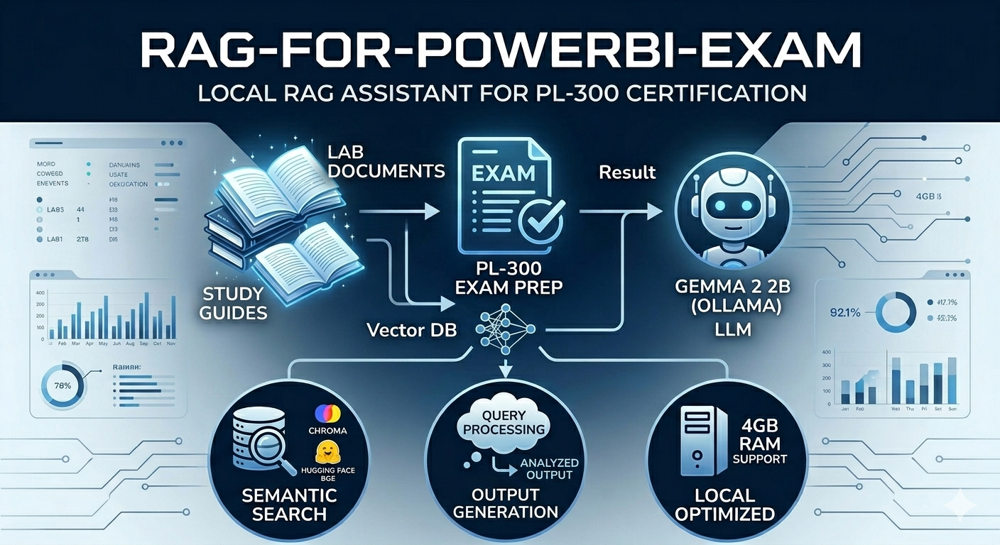

# RAG-for-PowerBI-Exam

## Project Overview
 
This project is an AI-powered assistant designed to help students prepare for the Microsoft Power BI Data Analyst (PL-300) certification. It uses Retrieval-Augmented Generation (RAG) to provide accurate answers based on official lab instructions and demo materials.

## Description
Preparing for technical certifications often involves navigating through hundreds of pages of documentation. This project simplifies the process by creating a local RAG pipeline. Using **LlamaIndex**, **ChromaDB**, and **Ollama**, the assistant retrieves relevant context from local Markdown files and generates expert responses in Russian. The system is optimized to run on local hardware with limited resources (e.g., 4GB RAM) using the **Gemma 2 2B** model.

## Strategic Insights

### **The Value**
The primary value of this assistant is its ability to provide grounded, "hallucination-free" answers. Unlike general-purpose AI, this tool strictly follows the provided training materials (Labs and Demos). It acts as a personal tutor that understands the specific steps and configurations required for the PL-300 exam, bridging the gap between raw study materials and student queries.

### **Why this approach works**:
- **Privacy & Locality**: Operates entirely offline using Ollama, ensuring no data leaves the local machine.
- **Resource Efficiency**: Optimized for low-end hardware through model quantization (Gemma 2 2B) and efficient vector indexing.
- **Contextual Accuracy**: Uses semantic search to find English context and translate/explain it in Russian for the user.

## Installation

1. **Clone the project:**
```bash
    git clone [https://github.com/Aleksei-Shashkov/RAG-for-PowerBI-Exam.git](https://github.com/Aleksei-Shashkov/RAG-for-PowerBI-Exam.git)
    cd RAG-for-PowerBI-Exam
Install Ollama & Models

Download Ollama from ollama.com.

Pull the lightweight Gemma model:

Bash
    ollama run gemma2:2b
Install Dependencies

Bash
    pip install llama-index llama-index-llms-ollama llama-index-embeddings-huggingface chromadb
Prepare Documents

Place your study materials (.md files) into the Instructions/Labs and Instructions/Demos folders ()

Run the Assistant

Bash
    python main.py
Repo Structure
RAG-for-PowerBI-Exam
├── assets/                  # Images and Project_description
├── chroma_db/               # Persistent vector database (auto-generated)
├── Instructions/            # Source documents (Labs & Demos)
├── main.py                  # Core application logic
├── query_history.txt        # Automated audit log of Q&A
├── questions.txt            # Sample exam questions for testing
└── README.md

This repository contains the hands-on lab exercises for Microsoft course [PL-300: Microsoft Power BI Data Analyst](https://docs.microsoft.com/en-us/learn/certifications/courses/PL-300T00). The labs are designed to accompany the learning materials and enable learners to practice using the technologies they describe.

Process & Methodology
┌──────────────┐      ┌────────────────┐      ┌──────────────────┐      ┌──────────────┐
│  User Query  │ ──►  │ Semantic Search│ ──►  │ Context Injection│ ──►  │ Final Result │
│  (Russian)   │      │  (ChromaDB)    │      │  (Prompt Eng)    │      │ (RU Answer)  │
└──────────────┘      └────────────────┘      └──────────────────┘      └──────────────┘
 "Как создать          Find Top-K relevant       Merge Query +             Streaming 
    меру?"              Lab chunks (EN)           Context (EN)              Response
I. Persistent Indexing & Smart Loading
The system implements a self-healing database check. It looks for an existing docstore.json in chroma_db. If found, it loads the index instantly; otherwise, it triggers a full re-indexing of the Instructions folder. This saves significant time and CPU resources during daily use.

II. Local LLM Integration (Ollama)
To overcome "Unknown model" errors and API costs, the system uses a custom Ollama wrapper. The Gemma 2 2B model was selected for its high performance-to-size ratio, allowing it to fit within a 3.7GB RAM footprint.

III. Streaming & Performance Optimization
To enhance user experience on limited hardware:

Streaming: Responses are displayed word-by-word as they are generated.

Timeout Management: Global timeouts are extended to 600s to allow for initial model loading on slower CPUs.

Top-K Refinement: The retriever is tuned to fetch only the 3 most relevant segments to keep the context window lean.

IV. Automated Audit Trail
Every interaction is captured in query_history.txt. Each entry includes:

Timestamp of the query.

The user's original question.

The AI-generated answer.
This creates a permanent record for reviewing difficult topics later.

Dynamic Prompt Engineering
The system uses a strict prompt template to enforce language consistency and grounding:

Python
template = (
    "INSTRUCTION: You are a Power BI expert. ALWAYS answer in RUSSIAN.\n"
    "Use only the provided text:\n"
    "---------------------\n"
    "{context_str}\n"
    "---------------------\n"
    "Question: {query_str}\n\n"
    "Your answer in RUSSIAN: "
)
Future Improvements
Self-Correction Loop: Implementing a secondary check to verify if the answer matches the retrieved Lab steps.

Web Interface: Migrating from terminal to a Gradio/Streamlit UI.

Multi-Model Support: Adding a toggle between Gemma 2 and TinyLlama for ultra-low resource environments.

## **Timeline**
This solo project was completed over 2 days.

## 📌 Personal context note
This project was done as part of the AI & Data Science Bootcamp at BeCode (Ghent), class of 2025-2026. 
Feel free to reach out or connect with me on [LinkedIn](https://www.linkedin.com/in/aleksei-shashkov-612458308/)!